# Oxidali

[English](README.md) | **Русский**

[](#лицензия)
[](hardware/LICENSE)

Oxidali — контроллер освещения DALI-2: прошивка на Rust для Waveshare ESP32-P4-ETH, корпус на
DIN-рейку для 3D-печати и инструменты, чтобы всё это собрать, запустить в симуляции и
протестировать. Контроллер ведёт одну линию DALI через собственный PHY на прерывании.
Он хранит реестр управляемых устройств (control gear) и устройств ввода, отдаёт REST и
WebSocket API, встроенный веб-интерфейс и мост в Home Assistant. Есть расписания
освещения по биоритмам (HCL) и небольшой движок правил. Два контроллера могут работать
на одной линии парой «основной — резервный».

Внутри кода проект сохраняет рабочее имя `dali2rust`: в именах крейтов, в переменных сборки
`DALI2RUST_*` и в поле manufacturer в Home Assistant.

<p align="center">
  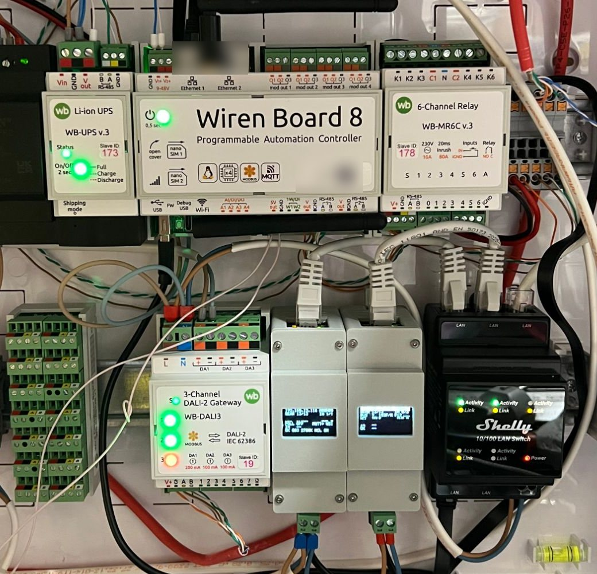
  &nbsp;
  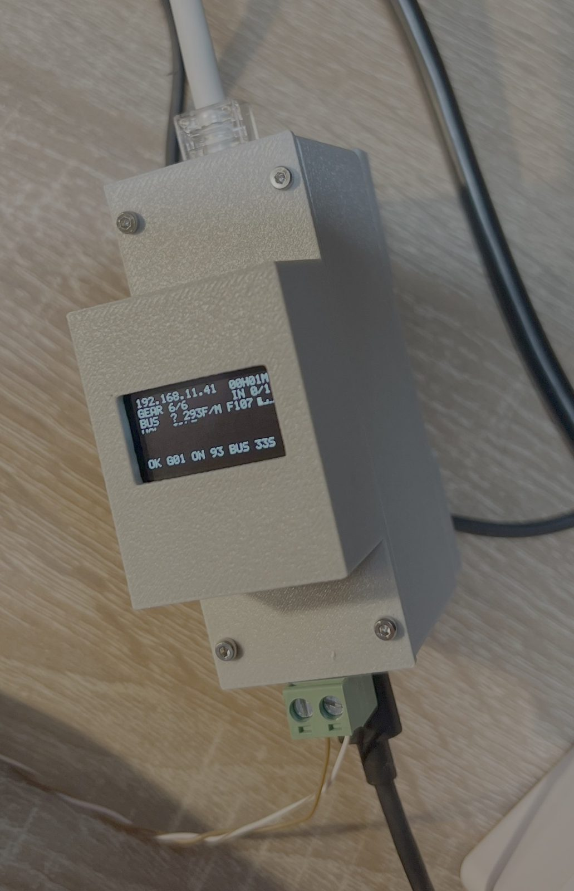
</p>

## Возможности

**Линия DALI**
- Собственный PHY: прерывание GPTimer формирует манчестерский код программно и
  распознаёт коллизии. Оно работает на уровне CLIC 5 и исполняется только из IRAM.
- Работа с другими мастерами. Контроллер делит линию с чужими мастерами: проходит
  арбитраж, повторяет кадр после коллизии и считает спорный ответ штатной ситуацией.
  Сниффер декодирует чужие кадры, и реестр остаётся в согласии с ними.
- Транзакции и приоритеты кадров по IEC 62386-101: фоновые чтения никогда не задерживают
  команду оператора.
- Устройства control gear по IEC 62386-102: светодиодные драйверы DT6 и цветные DT8
  (цветовая температура и RGBWAF). Читаются банк памяти 0 и банки DiiA Parts 251–253
  (данные светильника, энергия, диагностика).
- Устройства ввода по IEC 62386-103: кнопки (301), абсолютные входы (302), датчики
  присутствия (303), датчики освещённости (304) и индикаторы панелей (332). Контроллер
  принимает их 24-битные события и определяет их тип.
- Ввод в эксплуатацию: три режима сканирования, случайная адресация, `IDENTIFY DEVICE`,
  смена адреса и замена устройства.

**Модель и интеграции**
- Хранимый реестр физических устройств, виртуальных ламп, групп и сцен. Изменения групп
  и сцен применяются как отслеживаемые операции.
- REST API (`/api/v1/*`) и канал уведомлений по WebSocket (`/api/v1/ws`). Долгая
  операция отвечает `202` с идентификатором, по которому клиент следит за ней.
- Встроенный веб-интерфейс (Preact + TypeScript), который отдаётся из флеша. В нём
  есть панель, лампы, устройства, устройства ввода, группы, сцены, HCL, правила,
  консоль шины, сниффер, логи, операции, статистика, диагностика, прошивка и настройки.
- Home Assistant через MQTT discovery: лампы, группы, выбор сцены и события устройств
  ввода.
- Расписания HCL: кривые цветовой температуры и яркости, восход и закат, время по SNTP
  и часовые пояса, учёт ручного вмешательства.
- Движок правил со своим небольшим языком. Правила реагируют на события кнопок и
  датчиков; они компилируются на устройстве, и их можно прогнать вхолостую.
- Резервирование «основной — резервный». Два контроллера распределяют роли арбитражем
  на линии DALI (DiiA Part 351) и реплицируют конфигурацию по HTTP.
- Обновление прошивки по Ethernet: контроллер сам скачивает образ по URL и откатывается,
  если новый образ не подтвердил свою работоспособность.
- Экран состояния на OLED SSD1306 и счётчики работы (DALI, шина, сеть, память, MQTT,
  WebSocket) в `/api/v1/stats`.

**Инженерная часть**
- Весь продуктовый стек запускается на компьютере на симулированной линии DALI через
  тот же код сборки компонентов, что и в прошивке.
- Есть модульные тесты, интеграционные тесты крейтов на настоящем пути шины и
  BDD-набор «чёрного ящика» из более чем 500 сценариев cucumber, которые управляют
  хостовым стеком через HTTP и WebSocket.
- Набор инструментов hardware-in-the-loop (`tools/hil`) проверяет прошивку на реальных
  платах, в том числе оптическими тестами: откалиброванная USB-камера проверяет, что
  на самом деле показывает каждая лампа ([ниже](#hardware-in-the-loop-и-стендовые-инструменты)).

## Веб-интерфейс

Контроллер отдаёт этот интерфейс из своего флеша. Скриншоты сняты с хостового
dev-сервера, где работает тот же стек на симулированной линии.

<table>
  <tr>
    <td width="50%">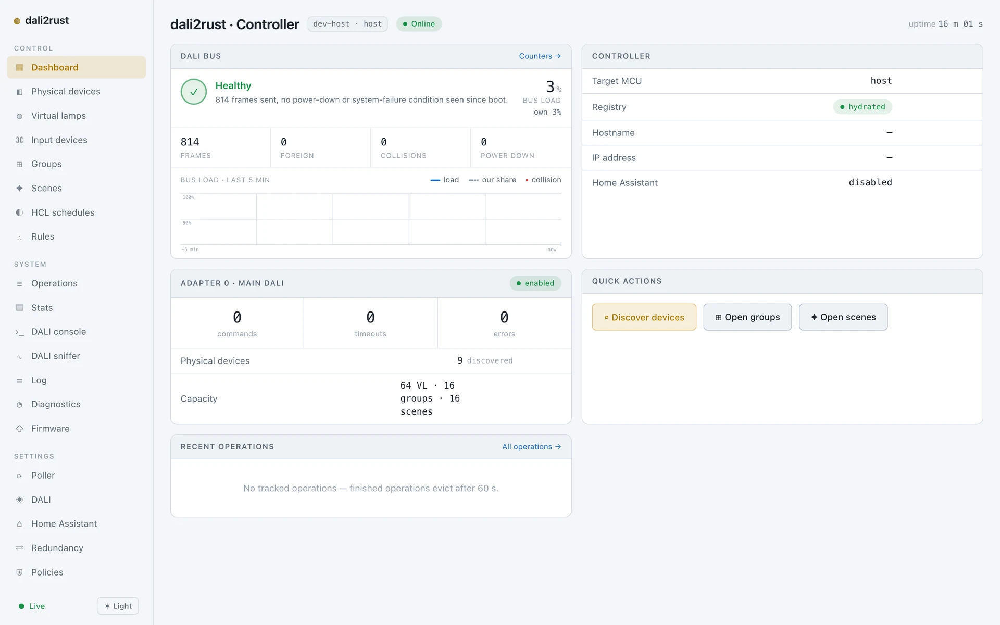</td>
    <td width="50%">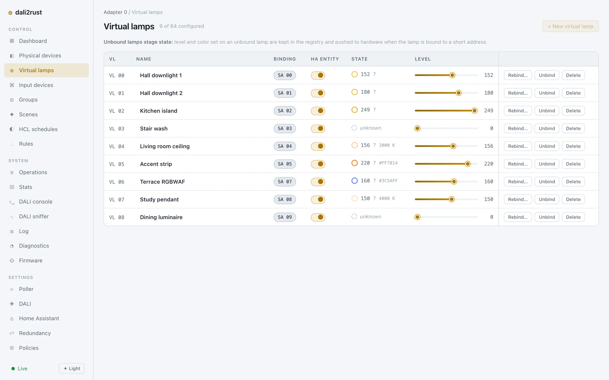</td>
  </tr>
  <tr>
    <td align="center">Панель: состояние шины, загрузка, счётчики</td>
    <td align="center">Виртуальные лампы: состояние, яркость, цвет</td>
  </tr>
  <tr>
    <td width="50%">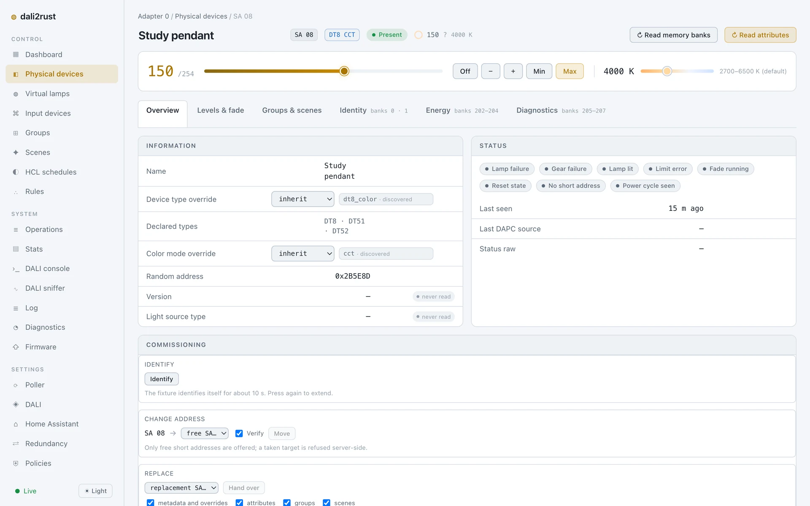</td>
    <td width="50%">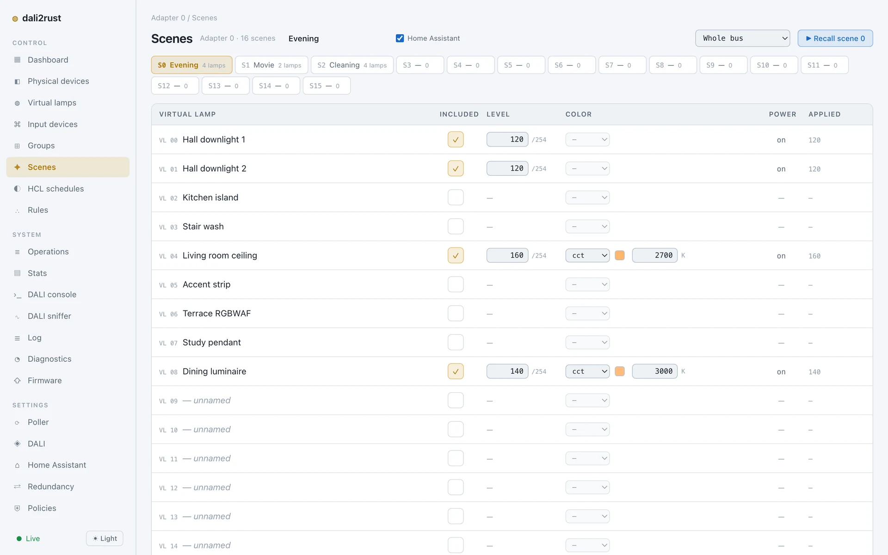</td>
  </tr>
  <tr>
    <td align="center">Карточка устройства: DT8 Tc, банки, ввод в эксплуатацию</td>
    <td align="center">Сцена: яркость и цвет каждой лампы, заданное против применённого</td>
  </tr>
  <tr>
    <td width="50%">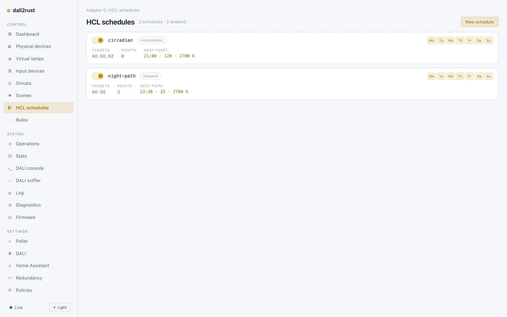</td>
    <td width="50%">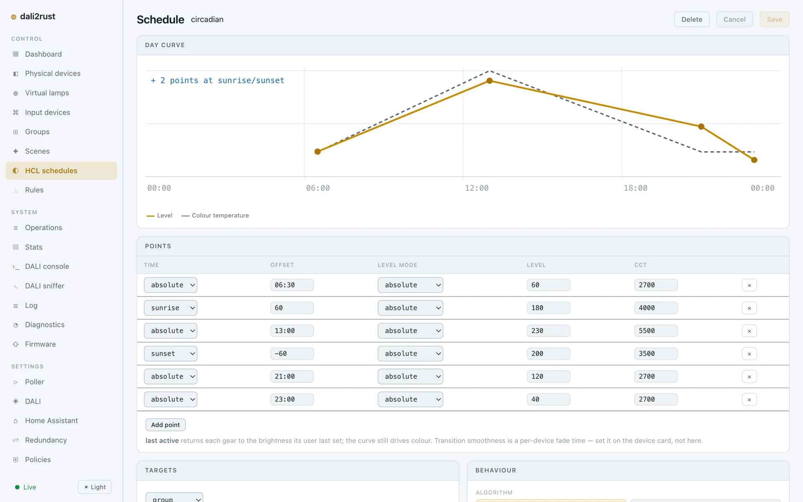</td>
  </tr>
  <tr>
    <td align="center">Расписания HCL</td>
    <td align="center">Дневная кривая HCL с привязкой к восходу и закату</td>
  </tr>
</table>

## Железо

| Компонент | Назначение |
| --- | --- |
| [Waveshare ESP32-P4-ETH](https://www.waveshare.com/esp32-p4-eth.htm) | Основная плата: двухъядерный RISC-V ESP32-P4, 32 МБ PSRAM, 32 МБ флеша, Ethernet 100 Мбит (радио нет) |
| Waveshare PoE Module (B) | Необязательно: питание платы по кабелю Ethernet |
| Waveshare Pico-DALI2 | Приёмопередатчик DALI на разъёме 2×20 формата Pico |
| OLED SSD1306 0,96″ 128×64, I²C | Экран состояния |
| Разъёмная клеммная колодка 2 контакта, шаг 5,08 мм (гнездо 2EDGV + вилка 2EDGK) | Внешний разъём DALI |
| Корпус, напечатанный на 3D-принтере | Пять деталей на DIN-рейке TS35 |

Линии нужен ещё блок питания шины DALI.

| Сигнал | GPIO ESP32-P4 | Разъём |
| --- | --- | --- |
| DALI TX (Pico-DALI2 его инвертирует) | 14 | контакт 9 / Pico GP6 |
| DALI RX | 17 | контакт 5 / Pico GP3 |
| Высоковольтный отвод приёмника DALI (не используется) | 18 | контакт 4 / Pico GP2 |
| OLED SDA | 33 | — |
| OLED SCL | 32 | — |

Карта выводов — в
[`crates/dali2rust-bsp/src/esp32p4/pins.rs`](crates/dali2rust-bsp/src/esp32p4/pins.rs).

### Корпус

- Модель FreeCAD: [`hardware/enclosure/dali2rust-case.FCStd`](hardware/enclosure/dali2rust-case.FCStd),
  размеры задаются таблицей `Params`.
- Файлы STEP, STL и 3MF для каждой детали и для сборки лежат в
  [`hardware/enclosure/export/`](hardware/enclosure/export/).
- Основа печатается из ABS-GF. Деталь с пружиной защёлки DIN-рейки печатается из
  ABS или ASA без наполнителя.

<table>
  <tr>
    <td>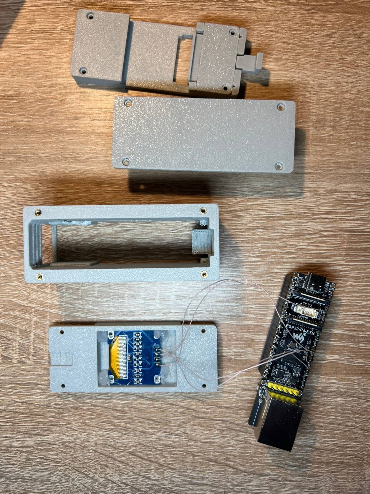</td>
    <td>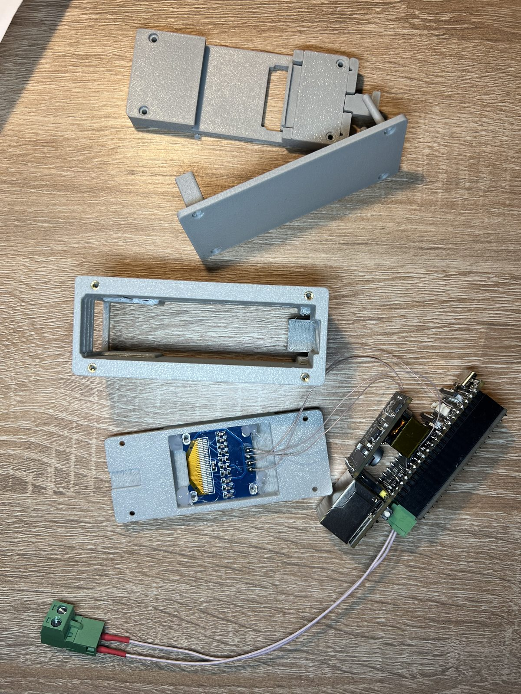</td>
    <td>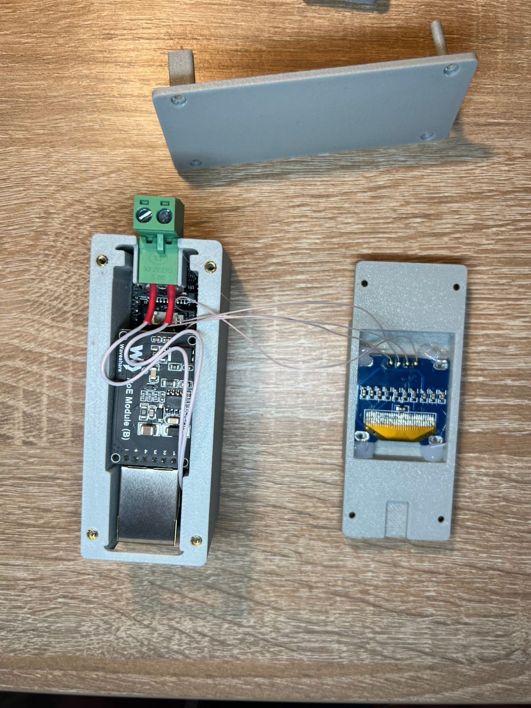</td>
  </tr>
  <tr>
    <td align="center">Детали корпуса и основная плата</td>
    <td align="center">С Pico-DALI2 и вилкой DALI</td>
    <td align="center">Стек плат в корпусе</td>
  </tr>
</table>

## Архитектура

### Система целиком

<p align="center">
  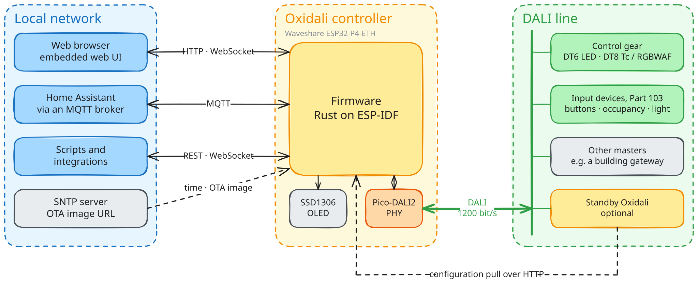
</p>

### Внутри контроллера: компоненты и их назначение

Всё, что хочет что-то изменить, публикует типизированную команду на шину в памяти. У
каждого вида команды ровно один владелец: только `DaliWorker` работает с проводом, и
только воркер реестра пишет в реестр.

<p align="center">
  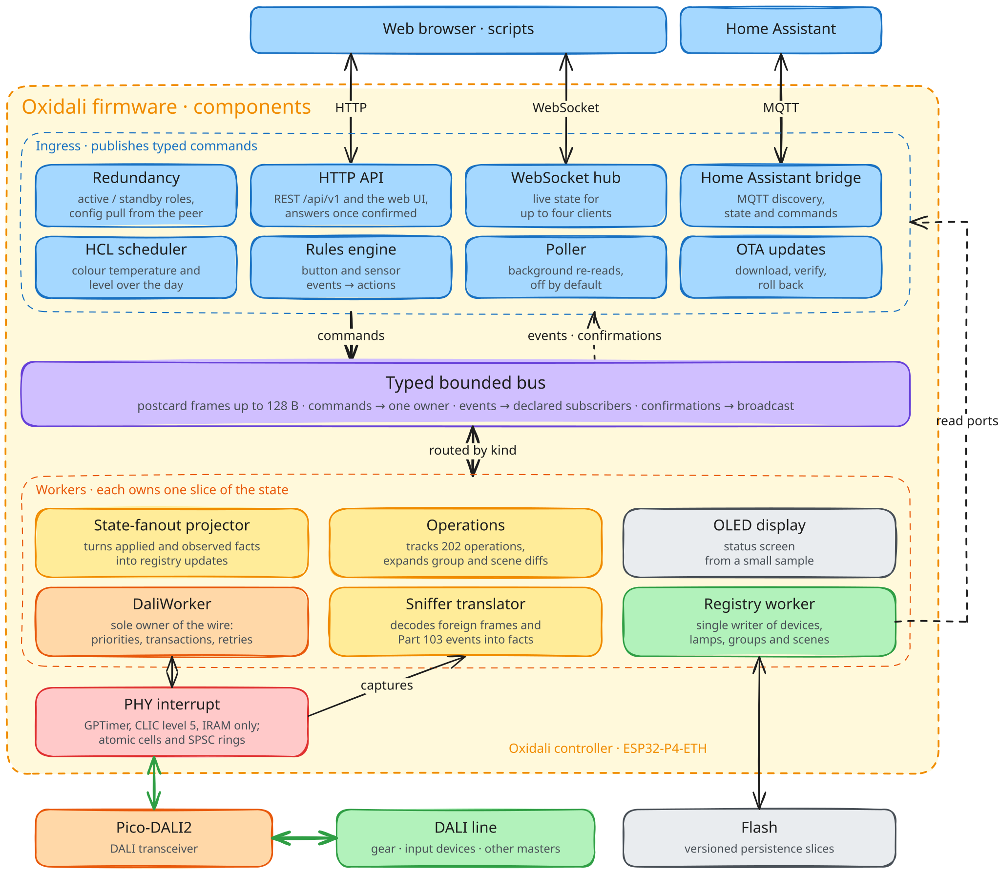
</p>

### Путь одного запроса

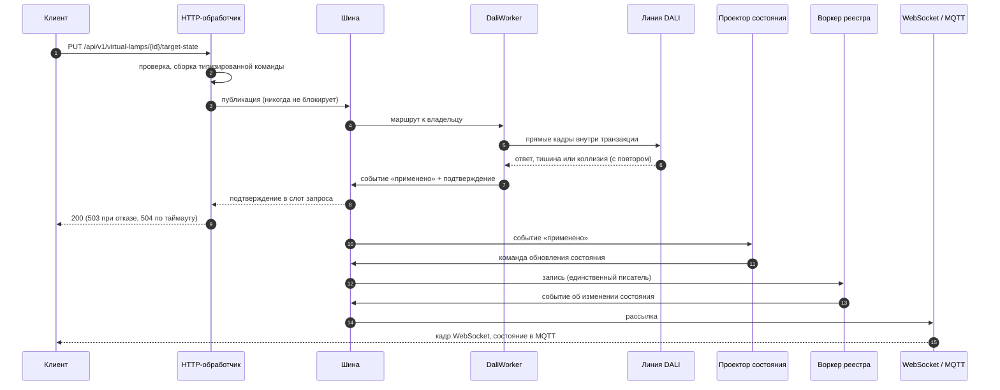

На компьютере та же сборка компонентов работает поверх `SimDaliTransport` — модели
настоящих устройств. На ней работают и BDD-набор, и dev-сервер из раздела ниже.
Архитектурные документы начинаются с
[`documentation/architecture/01-overview.md`](documentation/architecture/01-overview.md),
а решения за ними — это [ADR](documentation/architecture/decisions/README.md) (на
английском).

Схемы системы и компонентов — SVG из Excalidraw со встроенной сценой: откройте файл на
[excalidraw.com](https://excalidraw.com), чтобы его изменить.

## Быстрый старт

Проверенная хост-система — macOS на Apple silicon. Тройка хоста `aarch64-apple-darwin`
прописана в `justfile` (`default_host`) и в алиасах cargo. На другой системе передайте
`default_host=<тройка>` в `just` и `--target <тройка>` в `cargo`.

### Что установить

```bash
git clone https://github.com/ishergin/oxidali.git && cd oxidali
# сам Rust: https://rustup.rs
cargo install espup ldproxy espflash --locked
espup install    # тулчейн "esp", который выбирает rust-toolchain.toml, в том числе для хоста
brew install just    # или: cargo install just --locked
```

ESP-IDF v5.5.3 скачивается при первой сборке прошивки в `.embuild/`; для этого нужны
`git` и Python 3. Node.js 22 нужен только для пересборки веб-интерфейса: собранный
интерфейс лежит в репозитории. Если bindgen не находит libclang, выполните
`source ~/export-esp.sh` — этот файл создаёт `espup`.

### 1. Запуск без железа

Весь продуктовый стек на симулированной линии (девять устройств DT6 и DT8 и одно без
адреса) со встроенным веб-интерфейсом на http://127.0.0.1:8080/:

```bash
DALI2RUST_WEB_DIST_GZ=crates/dali2rust-firmware/assets/web \
  cargo run --target aarch64-apple-darwin -p dali2rust-adapters --example host_dev_server
```

```bash
curl http://127.0.0.1:8080/api/v1/health
```

Stdin сервера — консоль, которая изображает чужого мастера и настенную панель: `press`,
`release`, `foreign`, `occupancy`. С `DALI2RUST_DEV_SERVER_FLEET=bench` линия
заполняется всеми 64 адресами. Чтобы работать над интерфейсом с горячей перезагрузкой,
см. [`web/app/README.md`](web/app/README.md):

```bash
cd web/app && npm ci && npm run dev    # http://localhost:5173, /api проксируется на :8080
```

### 2. Тесты

```bash
just check     # проверка типов всех хостовых крейтов вместе с тестами
just test      # модульные и интеграционные тесты
just bdd       # BDD-набор «чёрного ящика»
just ci        # всё, что должно пройти изменение: clippy, тесты, BDD, гейты, проверка ESP
```

`just verify` и `just ci` проверяют и тестируют ещё и веб-интерфейс, поэтому перед ними
один раз выполните `(cd web/app && npm ci)`.

### 3. Сборка и прошивка

```bash
cargo fw       # собрать образ для riscv32imafc-esp-espidf
cargo flash    # собрать, записать загрузчик, таблицу разделов и приложение по USB, открыть монитор
```

Сначала подключите плату через USB-C. `cargo flash` запускает `espflash` с
`partitions-p4.csv`. При первом старте контроллер получает адрес по DHCP и показывает
его на OLED; откройте `http://<адрес>/`. Следующие обновления можно ставить по сети
(экран «Прошивка» или `POST /api/v1/firmware/updates`).

## Hardware-in-the-loop и стендовые инструменты

[`tools/hil`](tools/hil/README.md) — набор тестов на pytest, который управляет
настоящим контроллером на настоящей линии DALI и проверяет каждый эффект через
оракул, не доверяющий отчёту самой прошивки:

- REST и WebSocket API контроллера и его последовательная консоль;
- второй мастер DALI на той же линии (например, Wiren Board WB-MDALI3) как независимый
  сниффер и чужой мастер;
- **оптические тесты**: USB-камера смотрит на лампы, калибровка находит каждую лампу в
  кадре, а тесты проверяют, что каждая лампа включается и выключается, что яркость
  строго растёт с уровнем, что основные цвета RGB и 2700 K / 6500 K получаются такими,
  как заданы, и что вызов группы, сцена, расписание HCL или команда из Home Assistant
  доходят до самого света;
- второй контроллер пары «основной — резервный».

Каждому уровню тестов нужны только его инструменты, а руководство объясняет, как
запускать без каждого из них. Каждая сессия снимает конфигурацию контроллера и свет и в
конце восстанавливает их. Руководство — что нужно стенду,
настройка и первый запуск — в [`tools/hil/README.md`](tools/hil/README.md) (на
английском).

Ещё два инструмента рассчитаны на ESP32-C6 с Pico-DALI2 и пока не перенесены на
ESP32-P4:

- [`tools/dali-gear-sim`](tools/dali-gear-sim/README.md), **эмулятор ламп**: одна
  плата, которая на настоящей линии отвечает как парк примерно из пятидесяти
  виртуальных устройств (DT6, DT8 Tc, DT8 RGB+Tc) и потребляет ток одной нагрузки
  шины. Она даёт контроллеру полную шину на 64 адреса без 64 драйверов: весь поиск при
  вводе в эксплуатацию, обход поллером всех адресов, групповые и широковещательные
  команды и реестр на пределе. Короткие адреса 0–9 оставлены под настоящие лампы на том
  же проводе. Внутри — общий крейт `dali2rust-gear-model`, та же модель, что в хостовом
  симуляторе. HIL управляет эмулятором через его последовательную консоль
  (`HIL_GEAR_SIM_PORT`).
- [`tools/dali-arbiter`](tools/dali-arbiter/README.md), **внешний арбитр** (свидетель
  провода): плата только на приём, которая записывает сырые длительности импульсов
  периферией RMT. Прошивка не может сама судить о тайминге своей передачи, поэтому
  арбитр сравнивает наши кадры с кадрами эталонного мастера в одной записи;
  `hil/arbiter.py` декодирует записи и оценивает их.

## Планы

- **Кластер.** Несколько контроллеров работают как одна система: разрешённые групповые
  команды и вызовы сцен пересылаются между контроллерами по MQTT с подавлением петель
  ([проект](documentation/product-design/runtime-modules/cluster/README.md)).
- **Linux-сервис с DALI-модулем на Pico.** Тот же стек как Linux-демон (на хосте он
  уже работает), подключённый по USB или Ethernet к DALI-сопроцессору: RP2350 (Pico 2)
  с PIO на Pico-DALI2. Сопроцессор держит битовый тайминг, окна ожидания, распознавание
  коллизий и захват кадров, хост — прикладную логику. Это же даёт резервный контроллер
  на хосте, например на настенной панели
  ([ADR-019](documentation/architecture/decisions/ADR-019-standby-dali-endpoint.md), на
  английском).
- **Кнопочная панель DALI-2.** Устройство ввода в подрозетник с питанием от шины: от
  двух до четырёх кнопок, RGB-подсветка каждой кнопки, привязка касанием по NFC и
  обновление по BLE; говорит на Parts 103, 301 и 332. Схема в разработке.

## Структура репозитория

| Путь | Что там |
| --- | --- |
| `crates/` | Cargo workspace; `dali2rust-firmware` — единственная продуктовая точка сборки компонентов |
| `tests/dali2rust-bdd/` | BDD-набор на cucumber, «чёрный ящик» через HTTP против собранного хостового стека |
| `web/app/` | Веб-интерфейс, встроенный в прошивку |
| `web/design-system/` | Карточка дизайна для каждого экрана и компонента |
| `hardware/enclosure/` | Корпус на DIN-рейку: модель FreeCAD и её экспорт |
| `tools/hil/` | Набор инструментов для тестов hardware-in-the-loop |
| `tools/dali-gear-sim/`, `tools/dali-arbiter/` | Эмулятор ламп и внешний арбитр (ESP32-C6, пока не перенесены) |
| `scripts/` | Скрипты merge-гейтов (`just verify` запускает их все) |
| `documentation/` | Архитектура, записи решений и продуктовый дизайн |

## Документация

- [`documentation/README.md`](documentation/README.md) — карта документации:
  архитектура как она построена, ADR и продуктовый дизайн (REST API, контракты шины,
  runtime-модули, веб-интерфейс). Продуктовый дизайн написан по-русски, остальное — по-английски.
- [`CLAUDE.md`](CLAUDE.md) — правила для участников и кодовых агентов: границы
  архитектуры, потоки, тесты, контракты и merge-гейты.
- [`tools/hil/README.md`](tools/hil/README.md) — руководство по стенду.

Стандартов IEC 62386 и спецификаций DiiA в репозитории нет: их продают IEC и DALI
Alliance.

## Участие

Новое поведение начинается с падающего BDD-сценария. Перед тем как изменение попадёт в
ветку, `just ci` должен быть зелёным. Правила — в [`CLAUDE.md`](CLAUDE.md); рецепты
добавления команды, эндпоинта или воркера — в
[`11-extension-recipes.md`](documentation/architecture/11-extension-recipes.md).

## Лицензия

Программная часть распространяется на выбор под одной из лицензий:

- Apache License, Version 2.0 ([`LICENSE-APACHE`](LICENSE-APACHE));
- MIT ([`LICENSE-MIT`](LICENSE-MIT)).

Файлы проекта железа в [`hardware/`](hardware/) (модель корпуса и её
экспорт) распространяются под CERN Open Hardware Licence Version 2 –
Permissive ([`hardware/LICENSE`](hardware/LICENSE)).

Если вы явно не укажете иное, любой вклад, намеренно отправленный вами для включения в
проект, как это определено в Apache-2.0, распространяется под теми же двумя лицензиями
без дополнительных условий.

Таблица имён продуктов `web/app/public/dali-products.json` в репозитории пустая: база
продуктов DiiA здесь не распространяется.

DALI и DALI-2 — товарные знаки DALI Alliance. Проект не связан с DALI Alliance, прошивка
не сертифицирована по DALI-2.
