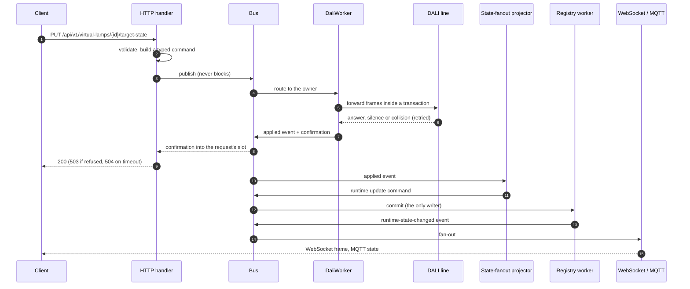

# Oxidali

**English** | [Русский](README.RU.md)

[](#license)
[](hardware/LICENSE)

Oxidali is a DALI-2 lighting controller: Rust firmware for the Waveshare ESP32-P4-ETH, a 3D-printed
DIN-rail enclosure, and the tooling to build, simulate and test it. The controller
drives one DALI line through its own interrupt-driven PHY. It keeps a registry of
control gear and input devices, and serves a REST and WebSocket API, an embedded web UI
and a Home Assistant bridge. Scheduling covers human-centric lighting (HCL) and a small
rules engine. Two controllers can share one line as an active/standby pair.

Inside the code the project keeps its working name, `dali2rust`: in crate names, the
`DALI2RUST_*` build knobs and the Home Assistant manufacturer string.

<p align="center">
  
  &nbsp;
  
</p>

## Features

**DALI line**
- Its own PHY: a GPTimer interrupt bit-bangs the line with Manchester coding and
  collision detection. It runs at CLIC level 5 from IRAM only.
- Multi-master aware. The controller shares the line with foreign masters: it
  arbitrates, retries after a collision and treats a contended answer as routine. A
  sniffer decodes foreign frames and keeps the registry in step with them.
- IEC 62386-101 transactions and frame priorities: background reads never delay an
  operator's command.
- Control gear per IEC 62386-102: DT6 LED gear, and DT8 colour gear (colour temperature
  and RGBWAF). Memory bank 0 and the DiiA banks of Parts 251–253 (luminaire data,
  energy, diagnostics) are read.
- Input devices per IEC 62386-103: push buttons (301), absolute inputs (302),
  occupancy sensors (303), light sensors (304) and panel indicators (332). The
  controller receives and types their 24-bit events.
- Commissioning: three scan modes, random addressing, `IDENTIFY DEVICE`, readdressing
  and gear replacement.

**Model and integrations**
- A persistent registry of physical devices, virtual lamps, groups and scenes. Group
  and scene changes are applied as tracked operations.
- A REST API (`/api/v1/*`) and a WebSocket push channel (`/api/v1/ws`). A long job
  answers `202` with an operation id that the client can poll.
- An embedded web UI (Preact + TypeScript) served from flash. Its screens include the
  dashboard, lamps, devices, input devices, groups, scenes, HCL, rules, a bus console,
  a sniffer, logs, operations, statistics, diagnostics, firmware and settings.
- Home Assistant over MQTT discovery: lights, groups, a scene selector and input-device
  events.
- HCL schedules: colour-temperature and level curves, sunrise and sunset, SNTP time and
  time zones, and manual override tracking.
- A rules engine with its own small language. Rules react to button and sensor events;
  they are compiled on the device and can be dry-run.
- Active/standby redundancy. The two units arbitrate roles on the DALI line (DiiA Part
  351) and replicate configuration over HTTP.
- Firmware updates over Ethernet: the controller pulls the image from a URL and rolls
  back if the new image does not prove itself healthy.
- A status screen on an SSD1306 OLED, and runtime counters (DALI, bus, network,
  memory, MQTT, WebSocket) at `/api/v1/stats`.

**Engineering**
- The whole product stack runs on a desktop against a simulated DALI line, through the
  same composition code as the firmware.
- There are unit tests, crate integration tests on the real bus path, and a black-box
  BDD suite of more than 500 cucumber scenarios that drive the host stack over HTTP and
  WebSocket.
- A hardware-in-the-loop toolkit (`tools/hil`) validates the firmware on real boards,
  including optical tests in which a calibrated USB camera checks what each lamp really
  shows ([below](#hardware-in-the-loop-and-bench-instruments)).

## Web UI

The controller serves this UI from its flash. The screenshots come from the host dev
server running the same stack on a simulated line.

<table>
  <tr>
    <td width="50%"></td>
    <td width="50%"></td>
  </tr>
  <tr>
    <td align="center">Dashboard: bus health, load and counters</td>
    <td align="center">Virtual lamps: live state, level and colour</td>
  </tr>
  <tr>
    <td width="50%"></td>
    <td width="50%"></td>
  </tr>
  <tr>
    <td align="center">A device card: DT8 colour temperature, banks, commissioning</td>
    <td align="center">A scene: per-lamp level and colour, desired against applied</td>
  </tr>
  <tr>
    <td width="50%"></td>
    <td width="50%"></td>
  </tr>
  <tr>
    <td align="center">HCL schedules</td>
    <td align="center">An HCL day curve anchored to sunrise and sunset</td>
  </tr>
</table>

## Hardware

| Part | Role |
| --- | --- |
| [Waveshare ESP32-P4-ETH](https://www.waveshare.com/esp32-p4-eth.htm) | Main board: dual-core RISC-V ESP32-P4, 32 MB PSRAM, 32 MB flash, 100 Mbit Ethernet (no radio) |
| Waveshare PoE Module (B) | Optional: powers the board from the Ethernet cable |
| Waveshare Pico-DALI2 | DALI transceiver on the board's Pico-format 2×20 header |
| SSD1306 0.96″ 128×64 I²C OLED | Status screen |
| 2-pole 5.08 mm pluggable terminal block (2EDGV header + 2EDGK plug) | External DALI connector |
| 3D-printed enclosure | Five parts on a TS35 DIN rail |

The line also needs a DALI bus power supply.

| Signal | ESP32-P4 GPIO | Header |
| --- | --- | --- |
| DALI TX (the Pico-DALI2 inverts it) | 14 | pin 9 / Pico GP6 |
| DALI RX | 17 | pin 5 / Pico GP3 |
| DALI high-voltage receive tap (never driven) | 18 | pin 4 / Pico GP2 |
| OLED SDA | 33 | — |
| OLED SCL | 32 | — |

The pin map lives in
[`crates/dali2rust-bsp/src/esp32p4/pins.rs`](crates/dali2rust-bsp/src/esp32p4/pins.rs).

### Enclosure

- FreeCAD model: [`hardware/enclosure/dali2rust-case.FCStd`](hardware/enclosure/dali2rust-case.FCStd),
  driven by a `Params` spreadsheet.
- STEP, STL and 3MF files for each part and for the assembly are in
  [`hardware/enclosure/export/`](hardware/enclosure/export/).
- The body is printed in ABS-GF. The part that carries the DIN-rail catch spring is
  printed in unfilled ABS or ASA.

<table>
  <tr>
    <td></td>
    <td></td>
    <td></td>
  </tr>
  <tr>
    <td align="center">Printed parts and the main board</td>
    <td align="center">With the Pico-DALI2 and the DALI plug</td>
    <td align="center">Board stack in the body</td>
  </tr>
</table>

## Architecture

### The system

<p align="center">
  
</p>

### Inside the controller: components and what they do

Everything that wants to change the world publishes a typed command on an in-memory
bus. Exactly one worker owns each command kind: only `DaliWorker` touches the wire, and
only the registry worker writes the registry.

<p align="center">
  
</p>

### One request, end to end



On the host, the same composition runs over `SimDaliTransport`, a model of real gear.
The BDD suite and the dev server below both use it. The architecture documents start at
[`documentation/architecture/01-overview.md`](documentation/architecture/01-overview.md),
and the decisions behind them are the [ADRs](documentation/architecture/decisions/README.md).

The system and component drawings are Excalidraw SVGs with the scene embedded: open one at
[excalidraw.com](https://excalidraw.com) to edit it.

## Quick start

macOS on Apple silicon is the tested host. The host triple `aarch64-apple-darwin` is
written into the `justfile` (`default_host`) and the cargo aliases. On another host,
pass `default_host=<triple>` to `just` and `--target <triple>` to `cargo`.

### Prerequisites

```bash
git clone https://github.com/ishergin/oxidali.git && cd oxidali
# Rust itself: https://rustup.rs
cargo install espup ldproxy espflash --locked
espup install    # the "esp" toolchain that rust-toolchain.toml selects, host builds included
brew install just    # or: cargo install just --locked
```

ESP-IDF v5.5.3 is downloaded by the first firmware build into `.embuild/` and needs
`git` and Python 3. Node.js 22 is needed only to rebuild the web UI; the built UI is
committed. If bindgen cannot find libclang, source the `~/export-esp.sh` that `espup`
writes.

### 1. Run it without hardware

The composed product stack on a simulated line (nine DT6 and DT8 gear and one
unaddressed unit), serving the committed web UI at http://127.0.0.1:8080/:

```bash
DALI2RUST_WEB_DIST_GZ=crates/dali2rust-firmware/assets/web \
  cargo run --target aarch64-apple-darwin -p dali2rust-adapters --example host_dev_server
```

```bash
curl http://127.0.0.1:8080/api/v1/health
```

The server's stdin is a console that plays a foreign master and a wall panel: `press`,
`release`, `foreign`, `occupancy`. Set `DALI2RUST_DEV_SERVER_FLEET=bench` for a full
64-address line. To work on the UI with hot reload, see
[`web/app/README.md`](web/app/README.md):

```bash
cd web/app && npm ci && npm run dev    # http://localhost:5173, proxies /api to :8080
```

### 2. Run the tests

```bash
just check     # type-check every host crate, test targets included
just test      # unit and integration tests
just bdd       # the black-box BDD suite
just ci        # everything a change must pass: clippy, tests, BDD, gates, ESP type-check
```

`just verify` and `just ci` type-check and test the web UI too, so run
`(cd web/app && npm ci)` once before them.

### 3. Build and flash the firmware

```bash
cargo fw       # build the image for riscv32imafc-esp-espidf
cargo flash    # build, write bootloader + partition table + app over USB, open the monitor
```

Connect the board's USB-C port first. `cargo flash` runs `espflash` with
`partitions-p4.csv`. On the first boot the controller takes an address over DHCP and
shows it on the OLED; open `http://<address>/`. Later updates can go over the network
(Firmware screen, or `POST /api/v1/firmware/updates`).

## Hardware-in-the-loop and bench instruments

[`tools/hil`](tools/hil/README.md) is a pytest suite that drives a real controller on a
real DALI line and checks every effect through an oracle that does not trust the
firmware's own report:

- the controller's REST and WebSocket API and its serial console;
- a second DALI master on the same line (for example a Wiren Board WB-MDALI3) as an
  independent sniffer and a foreign master;
- **optical tests**: a USB camera looks at the lamps, a calibration finds each lamp in
  the frame, and the tests check that every lamp switches on and off, that brightness
  rises strictly with the level, that RGB primaries and 2700 K / 6500 K come out as
  commanded, and that a group recall, a scene, an HCL schedule or a Home Assistant
  command reaches the light itself;
- the second controller of an active/standby pair.

Each tier needs only its own instruments, and the runbook says how to run without each
one. Every session snapshots the controller's configuration and the light and restores
them afterwards. The runbook, with what a bench needs, the configuration and
the first run, is [`tools/hil/README.md`](tools/hil/README.md).

Two more instruments target an ESP32-C6 with a Pico-DALI2 and are not yet ported to the
ESP32-P4:

- [`tools/dali-gear-sim`](tools/dali-gear-sim/README.md), the **gear emulator**: one
  board that answers on a real line as a fleet of about fifty virtual control gear
  (DT6, DT8 Tc, DT8 RGB+Tc) while drawing a single bus load. It gives the controller a
  full 64-address bus without 64 drivers: the whole commissioning search, a poller sweep
  over every address, group and broadcast applies, and a registry at its ceiling. Short
  addresses 0–9 are reserved for the real lamps on the same wire. It runs the shared
  `dali2rust-gear-model` crate, the same model as the host simulator. The HIL toolkit
  drives it over its serial console (`HIL_GEAR_SIM_PORT`).
- [`tools/dali-arbiter`](tools/dali-arbiter/README.md), the **wire witness**: a
  receive-only board that records raw pulse widths with the RMT peripheral. The firmware
  cannot judge its own transmit timing, so this board compares our frames with a
  reference master's frames in the same capture; `hil/arbiter.py` decodes and scores the
  captures.

## Roadmap

- **Cluster.** Several controllers act as one system: permitted group commands and
  scene recalls are forwarded between controllers over MQTT, with loop suppression
  ([design](documentation/product-design/runtime-modules/cluster/README.md), in Russian).
- **A Linux service with a Pico DALI endpoint.** The same stack as a Linux daemon (it
  already runs on a host), attached over USB or Ethernet to a DALI coprocessor: an
  RP2350 (Pico 2) with PIO on the Pico-DALI2. The coprocessor keeps bit timing,
  settling windows, collision detection and frame capture; the host keeps the
  application. It also allows a host-based standby, such as a wall panel
  ([ADR-019](documentation/architecture/decisions/ADR-019-standby-dali-endpoint.md)).
- **A DALI-2 push-button.** A bus-powered wall-box input device with two to four
  buttons, RGB feedback per button, NFC tap-to-bind and BLE updates, speaking Parts 103,
  301 and 332; the schematic is being drawn.

## Repository layout

| Path | What it holds |
| --- | --- |
| `crates/` | The Cargo workspace; `dali2rust-firmware` is the only production composition root |
| `tests/dali2rust-bdd/` | The cucumber BDD suite, black-box over HTTP against the composed host stack |
| `web/app/` | The web UI embedded in the firmware |
| `web/design-system/` | A design card for every screen and component |
| `hardware/enclosure/` | The DIN-rail enclosure: the FreeCAD model and its exports |
| `tools/hil/` | The hardware-in-the-loop test toolkit |
| `tools/dali-gear-sim/`, `tools/dali-arbiter/` | The gear emulator and the wire witness (ESP32-C6, not ported yet) |
| `scripts/` | Merge-gate scripts (`just verify` runs them all) |
| `documentation/` | Architecture, decision records and the product design |

## Documentation

- [`documentation/README.md`](documentation/README.md) is the map: the as-built
  architecture, the ADRs, and the product design (REST API, bus contracts, runtime
  modules, web UI). The product-design package is written in Russian.
- [`CLAUDE.md`](CLAUDE.md) holds the rules for contributors and coding agents:
  architecture boundaries, threading, testing, contracts and merge gates.
- [`tools/hil/README.md`](tools/hil/README.md) is the bench runbook.

The IEC 62386 standards and DiiA specifications are not included. They are sold by the
IEC and the DALI Alliance.

## Contributing

New behaviour starts with a failing BDD scenario. `just ci` must be green before a
change lands. The rules are in [`CLAUDE.md`](CLAUDE.md); the recipes for adding a
command, an endpoint or a worker are in
[`11-extension-recipes.md`](documentation/architecture/11-extension-recipes.md).

## License

The software is licensed under either of

- Apache License, Version 2.0 ([`LICENSE-APACHE`](LICENSE-APACHE)), or
- MIT license ([`LICENSE-MIT`](LICENSE-MIT)),

at your option. The hardware design files in [`hardware/`](hardware/) (the enclosure
model and its exports) are licensed
under the CERN Open Hardware Licence Version 2 – Permissive
([`hardware/LICENSE`](hardware/LICENSE)).

Unless you explicitly state otherwise, any contribution intentionally submitted for
inclusion in the work by you, as defined in the Apache-2.0 license, shall be dual
licensed as above, without any additional terms or conditions.

The product-name table in `web/app/public/dali-products.json` ships empty: the DiiA
product database is not redistributed here.

DALI and DALI-2 are trademarks of the DALI Alliance. This project is not affiliated with
the DALI Alliance, and the firmware is not DALI-2 certified.
