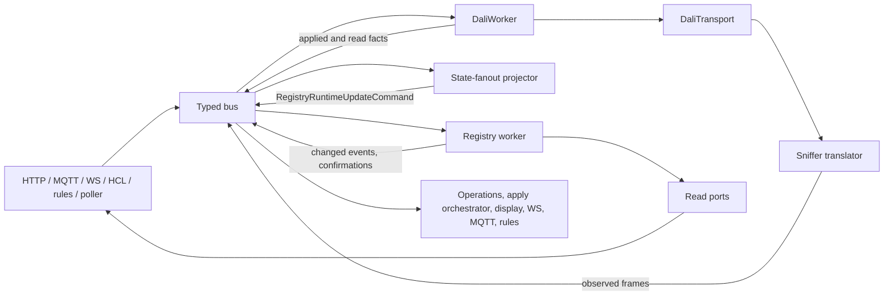

# 01 Overview

What the controller is made of: the crates and what each owns, the composition root, the
composed runtimes, and the crate boundaries that are decisions.

Scope: crate responsibilities and cross-crate rules; each subsystem has its own document
([reading order](README.md)). What the product does lives in
[`../product-design/`](../product-design/README.md).

## Hardware

- One board: Waveshare ESP32-P4-ETH (dual-core RISC-V, 32 MB PSRAM, 32 MB flash). Wired
  Ethernet is the only network path; the P4 has no radio
  ([ADR-011](decisions/ADR-011-retire-esp32s3.md)).
- The DALI bus is bit-banged by a GPTimer interrupt that owns the PHY
  ([08](08-dali-phy-and-transport.md)).

## Crates

| Crate | Owns |
| --- | --- |
| `dali2rust-contracts` | Canonical message types (`msg/`), bus envelopes, the `postcard` codec and frame budget |
| `dali2rust-bus` | Bounded typed bus: channel traits, routing task, publisher, required publish, correlation ids |
| `dali2rust-domain` | Pure DALI and registry logic and the domain traits (controller, read ports); no I/O |
| `dali2rust-platform` | HAL traits, the lock-free primitives all layers share (wire lease, sniffer tap, wire counters, flash gate) and the in-place slice sort; no ESP-IDF types, no business rules |
| `dali2rust-api` | HTTP router and handlers, the confirmation bridge, and every byte of JSON (REST DTOs, `src/ws/`, `src/ha/`) |
| `dali2rust-adapters` | The composition helper and adapter implementations: DALI transports (ESP, mock, sim), ESP and host HTTP servers, console logging |
| `dali2rust-dali-phy` | Everything the PHY interrupt executes, and nothing else (`no_std`) — [ADR-010](decisions/ADR-010-isr-crate-and-profile-exception.md) |
| `dali2rust-dali-codec` | Manchester encode/decode, in task context |
| `dali2rust-gear-model` | Stateful fake control gear (Parts 102/207/209 slave side); host-only |
| `dali2rust-dali-runtime` | `DaliWorker`, the one owner of the DALI wire: semantic executor, controller, priority table |
| `dali2rust-registry-runtime` | `RegistryStore`, its single-writer worker, the persistence slices |
| `dali2rust-operations-runtime` | Operation tracker and apply orchestrator ([ADR-007](decisions/ADR-007-apply-orchestrator.md)) |
| `dali2rust-fanout-runtime` | State-fanout projector and sniffer translator |
| `dali2rust-display-runtime` | OLED display worker, screens and fonts |
| `dali2rust-hcl-runtime` | HCL scheduler: curves, astronomy, override tracking |
| `dali2rust-poller-runtime` | Background interval reader (off by default) |
| `dali2rust-ws-runtime` | WebSocket client hub and fan-out worker |
| `dali2rust-mqtt-runtime` | Home Assistant MQTT bridge and broker client; owns the `HomeAssistant*` kinds |
| `dali2rust-rules-model` | Typed rule graph, limits, `RuleCompiler` / `NameResolver` traits |
| `dali2rust-rules-lang` | The rule-language compiler (`LANG_RULES_V1`): source text → model |
| `dali2rust-rules-runtime` | Rules document store and worker, its persistence, the engine |
| `dali2rust-redundancy-runtime` | Controller redundancy: arbitration lease, supervisor, arbitration and replication workers ([ADR-018](decisions/ADR-018-controller-redundancy.md)) |
| `dali2rust-ota-runtime` | Firmware update over the network ([ADR-024](decisions/ADR-024-ota-over-ethernet.md)) |
| `dali2rust-bsp` | Board support: thread spawner, stack classes, task registry, PSRAM box, heap stats, slice-store flash binding |
| `dali2rust-test-support` | Shared host-side test helpers and port doubles |
| `dali2rust-firmware` | The binary and the only production composition root |

`tests/dali2rust-bdd` is the black-box BDD crate ([05](05-testing-and-bdd.md)).

## Composition

- `dali2rust-firmware` builds the stack by calling
  `dali2rust_adapters::build_router_with_bus_and_transport` with the real transport. The
  helper is generic over `DaliTransport`; BDD and the host dev server call it with
  `MockDaliTransport` and `SimDaliTransport`, so every test runs the production wiring.
- Adapters wire and bind; business rules never live there. A worker's logic and its
  spawn function belong to the runtime crate that owns the slice.
- The API layer never holds a mutex around the DALI transport. HTTP, MQTT, WebSocket,
  HCL and rules code publish typed commands on the bus; none of them calls
  `DaliTransport` or mutates the registry directly ([03](03-bus-and-backpressure.md)).
- One DALI adapter is composed (registry adapter 0); the multi-adapter model is designed
  but not wired.

## Crate boundaries that are decisions

- **The codec and the gear model are shared crates because DALI has a second endpoint.**
  `tools/dali-gear-sim`, a gear emulator, speaks the same wire and needs the same slave
  semantics but is its own cargo workspace ([10](10-build-release-and-tooling.md)). The
  host `SimDaliTransport` runs the gear model,
  implements the observed-frame seam, and the dev server's stdin console
  (`press` / `release` / `foreign` / `occupancy`) plays a foreign master, so the sniffer
  translator, fan-out from foreign frames, Part 103 events and rule triggers run on the
  host ([ADR-014](decisions/ADR-014-gear-model-and-second-dali-endpoint.md)).
- **`ws-runtime` and `mqtt-runtime` depend on `api`.** Their JSON is built in
  `dali2rust-api/src/ws/` and `src/ha/` only; the runtime crates carry pre-serialized
  strings ([04](04-contracts-and-api-bridge.md)).
- **The rule language is three crates.** `rules-model` is the stable contract,
  `rules-lang` is one compiler behind `dyn RuleCompiler`, `rules-runtime` consumes the
  model and never sees text. The stored canon is the operator's source text, tagged with
  the `lang_id` that compiled it; there is no printer. A replacement language is a new
  crate and a new id, not an engine change
  ([ADR-016](decisions/ADR-016-input-devices-and-rule-engine.md)).
- **There is no input-device runtime.** Part 103 commissioning, instance enumeration
  and configuration are semantic commands executed inside `DaliWorker`: one wire owner,
  one priority table, one transaction mechanism (ADR-016).

## Trait placement

- HAL traits → `platform`; DALI and domain traits → `domain`; bus channel traits →
  `bus`; HTTP traits → `api`; rule-language traits → `rules-model`.
- No ESP-IDF types in `platform` or `domain`; ESP-only code sits behind
  `#[cfg(target_os = "espidf")]`.

## Composed runtimes

Composed: DALI worker, registry, operations and apply orchestrator, state fan-out and
sniffer translator, display, HCL scheduler, poller, WebSocket, Home Assistant MQTT
bridge, statistics, rules engine, controller redundancy, OTA. Designed only: cluster and
adapter proxy ([`../product-design/runtime-modules/`](../product-design/runtime-modules/README.md)).
Stage status: [`../product-design/status.md`](../product-design/status.md).

## System-wide properties

- The DALI runtime shares its bus with foreign masters: a contended exchange is retried
  or re-read under a bounded budget, not reported as a gear fault
  ([08](08-dali-phy-and-transport.md), [09](09-dali-protocol-rules.md)).
- Background work never delays an operator on the wire
  ([09](09-dali-protocol-rules.md)).
- Group and scene apply diffs are expanded by the apply orchestrator
  ([06](06-registry-and-persistence.md), ADR-007).
